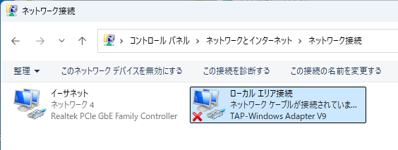
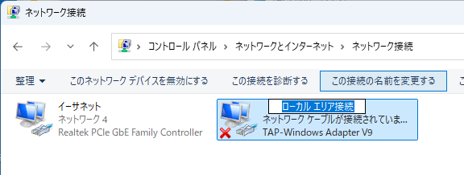
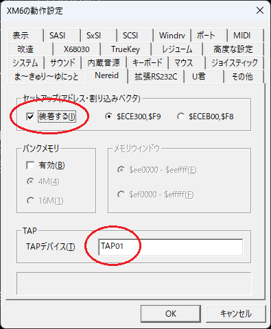
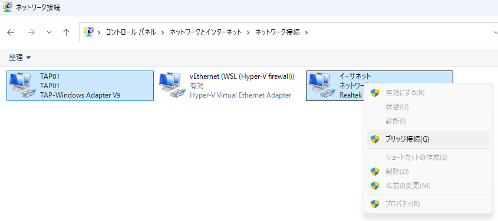
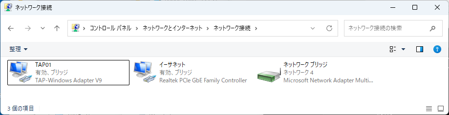
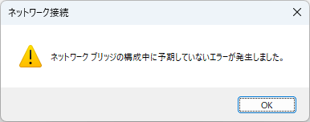
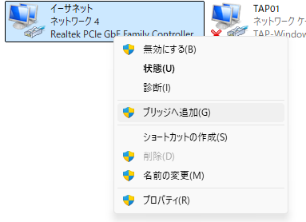

# XM6 TypeGのNereidのLAN機能を設定してみる  
## やりたいこと  
・XM6 TypeG上で動くHuman68k環境でLANを使えるようにする  
　　(XM6 TypeG + NetBSDであれば https://xbeeing.com/xm6typeg-netbsd-x68k-9-0-nereid/ の解説が詳しいです)
## 必要なもの
・Windows用のTAPドライバ  
　→ OpenVPNをインストールするか、OpenVPNのTAPドライバを単独でインストールする  
 　　参考) https://www.choge-blog.com/programming/windows-tapdevice/  
・計測技研のネットワークソフト(TCPPACKA)  
　→ こちらでダウンロードできます http://retropc.net/x68000/software/internet/kg/tcppacka/  
・Neptune-X / Nereid 用のネットワークドライバ  
　→ etherL12.sys : http://retropc.net/x68000/software/hardware/nereid/   
　→ etherL12wa.sys : https://github.com/yunkya2/etherL12  
　　※"etherL12wa.sys"はXM6 TypeG(Ver3.37以前)＋X68030エミュレーション環境専用  
  
## やっておくこと  
・XM6 TypeG上でX68000もしくはX68030環境を動くようにしておく  
  
## 実際の作業  
### WindowsにTAPドライバをインストールする  
OpenVPNをインストールするか、TAPドライバを単独でインストールします。  
 　参考) https://www.choge-blog.com/programming/windows-tapdevice/  
ちゃんとインストールできた場合、ネットワーク接続の一覧画面で見るとこんな感じです。  
TAPドライバに赤い✕が付いているのはこの時点ではTAPドライバの先にアプリが接続されてないからです
    
### インストールしたアダプタをリネームする
インストールしたそのままだとXM6 TypeGからの指定が面倒なのでわかりやすい名前にリネームします  
TAPドライバをクリックして選択→上に表示される「この接続の名前を変更する」をクリック→わかりやすい名前に変更します  
　
### XM6 TypeGの設定画面でNereidを有効化して、TAPドライバ名を設定する  
こんな感じで赤丸の個所を適宜設定します。先ほどリネームしたTAPドライバ名を指定します    
　  
### Windows側のLAN環境を確認する  
・ipconfigでIPアドレスやネットマスクを調べる  
・DHCP環境の場合、DHCPに割り当てられない空きアドレスも調べておく  
### XM6 TypeG上のHuman68k環境を設定する  
#### CONFIG.SYS  
・"PROCESS=”行を設定する  
　→TCPPACKAのドキュメントには "PROCESS=2 10 10"、Nereidのドキュメントには"PROCESS=32 10 100"とあります。とりあえずどちらでも動きます。  
・etherL12.sys or etherL12.sys を組み込む  
　→ rtherL12wa.sysはX68030をエミュレーションしている場合専用です。
#### ifconfigとinetdconf  
・ループバック(localhost)を使えるようにする： ifconfig lp0 up
・ローカルネットワークの空きアドレスを en0 に設定する  
　例) ifconfig en0 192.168.10.100 netmask 255.255.255.0  
　　→この例ではウチのWifiルータにぶら下がっているLANが192.168.10.xxxで、DHCPのアドレス割り当て範囲が101-200なので空いている100を設定しています  
　　→netmaskはホストPCと同じでいいです(ホストPC上でipconfigコマンド実行すれば確認できます)  
・inetdconfでゲートウェイアドレスとdnsを指定しておきます  
　例) inetdconf +router 192.168.10.1 +dns 192.168.10.1  
　　→この例では我が家のWifiルータにぶら下がっているおうちLANの値を設定しています  
・これらの設定は設定がうまくいったらAUTOEXEC.BATに記述しておくと以降の手間が省けます
### Windows上のネットワークアダプタのブリッジ設定  
こんな感じで、コントロールキーを押しながらTAPドライバとホストPCのLANアダプタを選択して右クリックで「ブリッジ接続」を選択します。  
　  
うまくブリッジアダプタが作成されるとネットワーク接続一覧はこんな感じになります 
 (この例だとXM6 TypeGを起動しているため赤い✕が消えています）
　  

こんなエラーが表示されちゃった場合は・・・  
　  

こんな感じでブリッジアダプタ仲間に入れなかったアダプタを右クリック→ 「ブリッジへ追加」を選択するとうまくアダプタがガッチンコされます。  
　  
## 確認  
・Windows側からHuman68kへpingを打ってみる  
・Human68k側から適当なサイトへpingを打ってみる  
